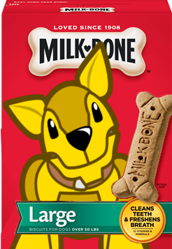

---
# Feel free to add content and custom Front Matter to this file.
# To modify the layout, see https://jekyllrb.com/docs/themes/#overriding-theme-defaults

layout: page
---

{: .image-left} There is a lot of documentation available for the 
[Apache TinkerPop&trade;][tinkerpop-home] graph computing framework. There is the project's 
[Reference Documentation][refdocs] as well as its [tutorials and recipes][alldocs]. There is the freely available 
online book [Practical Gremlin][practical-gremlin] which is a excellent resource for learning the Gremlin language. 
Despite all these resources and places where documentation could go, [I][me] often come across bits of Gremlin, 
"snippets" perhaps, that are interesting or noteworthy, but fail to be classified well into a category or place. 
These snippets are interesting in the sense that they teach a way of thinking in the language rather than specific 
patterns themselves and in that way it would be nice to see them documented and explained. 

The general theme of this space will be around the idea that there are these snippets of Gremlin that have a 
fleeting interest in the moment. A specific explanation within a snippet may directly apply to some aspect of what 
you happen to be working on in a day. However, reading these posts is likely to promote general Gremlin thinking,
which hopefully elevates your ability to write complex graph traversals.

[tinkerpop-home]: https://tinkerpop.apache.org
[refdocs]: https://tinkerpop.apache.org/docs/current/reference
[alldocs]: https://tinkerpop.apache.org/docs/current/
[practical-gremlin]: http://kelvinlawrence.net/book/Gremlin-Graph-Guide.html
[me]: about/

<h2>Recent Posts</h2>

<ul class="post-list">
  
  <li>
    {{ post.date | date: "%b %-d, %Y" }}
    <h3>
      <a class="post-link" href="{{ post.url | relative_url }}">{{ post.title }}</a>
    </h3>
    
    
{{ post.synopsis }}

    
  </li>
  
  
  <li>No posts yet.</li>
  
  </ul>

<a href="{{ '/posts/' | relative_url }}">All posts →</a>

